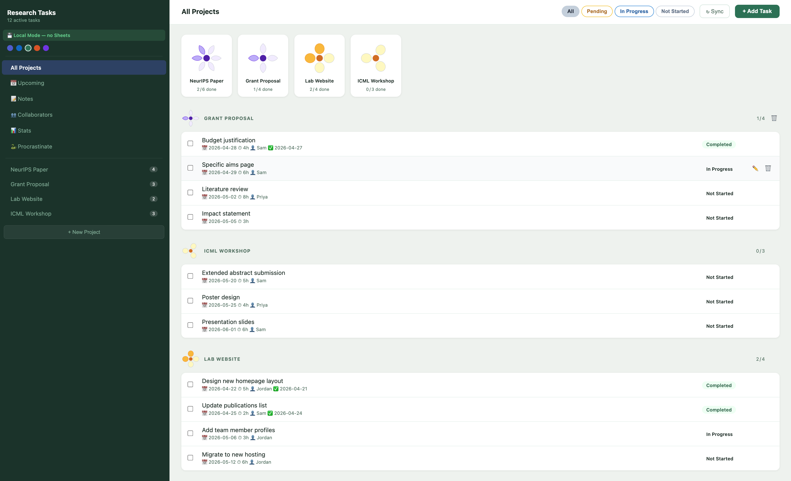
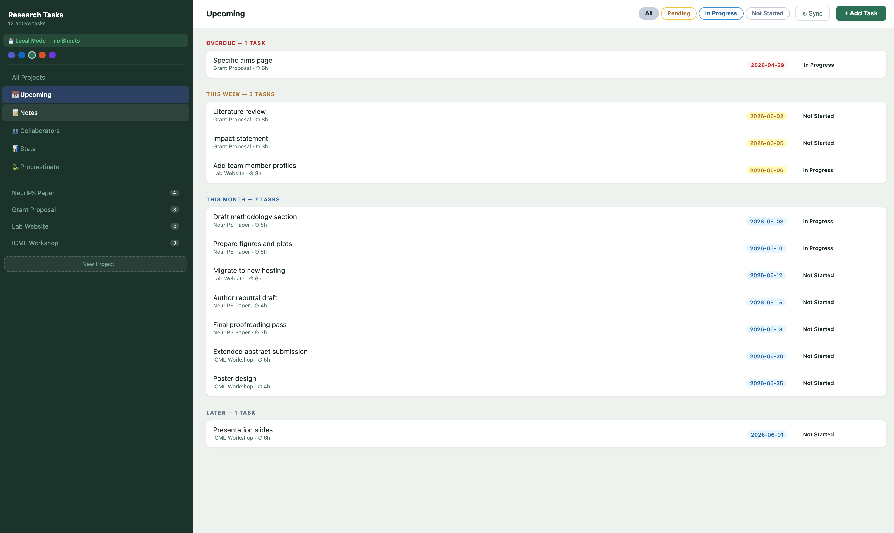
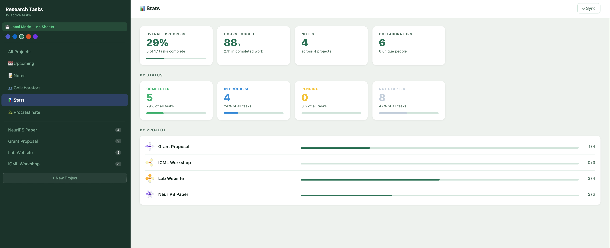
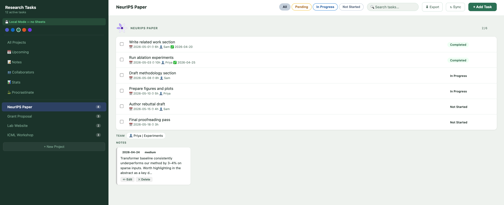
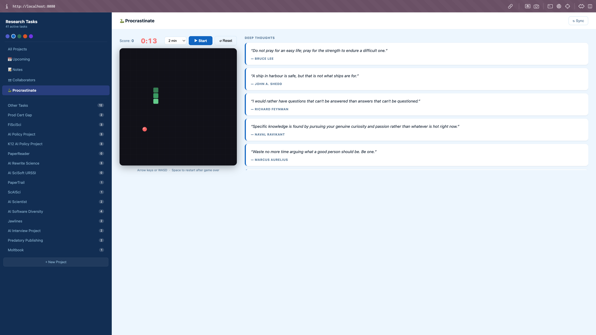
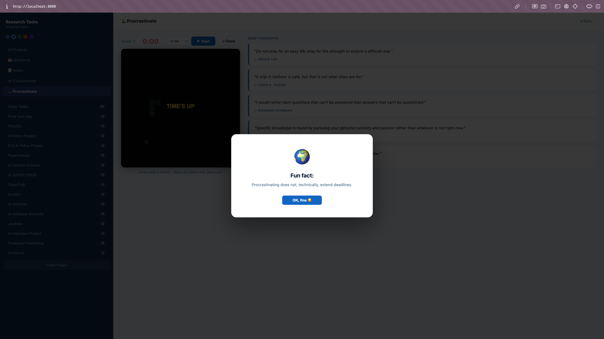

# Research Task Manager

A lightweight browser-based task manager built for researchers. Backed by Google Sheets (or runs fully offline) — track projects, deadlines, notes, and collaborators from a clean local web UI.



---

## Features

- **Projects** — each Google Sheet tab is a project; works fully offline without one
- **Tasks** — track deadline, hours, status (Not Started / In Progress / Pending / Completed), and assignee
- **Upcoming view** — tasks grouped by deadline urgency: Overdue → This Week → This Month → Later



- **Stats** — overall progress, hours logged, status breakdown, and per-project completion bars



- **Notes** — colorful cards with importance/purpose tags, sorted newest-first
- **Collaborators** — per-project team members with role labels; assignable to tasks



- **Flower progress** — each project gets a unique SVG flower; petals fill as tasks complete
- **Search** — filter tasks across all projects instantly
- **Bulk status change** — select multiple tasks and mark them all at once
- **Export CSV** — download any project's tasks as a spreadsheet
- **Themes** — five pastel color themes (Classic, Ocean, Sage, Sunset, Lavender)
- **Procrastinate tab** — snake game with a timer and deep quotes for earned breaks





- **Sync on demand** — data cached locally; click **↻ Sync** to pull latest from Sheets

---

## Quick start

### macOS
Double-click `start.command`.  
First run: right-click → **Open** to bypass Gatekeeper, then double-click from then on.

### Windows
Double-click `start.bat`.

Both launchers automatically create a virtual environment, install dependencies, and open the app at [http://localhost:8080](http://localhost:8080). No Google Sheets configuration required — the app runs in local mode out of the box.

---

## Google Sheets setup (optional)

Skip this section if you want to use local storage only.

### 1. Create your Google Sheet

1. Go to [sheets.google.com](https://sheets.google.com) and create a new spreadsheet.
2. Add one tab per project (e.g. "NeurIPS Paper", "Grant Application").
3. Copy the **Sheet ID** from the URL:
   ```
   https://docs.google.com/spreadsheets/d/YOUR_SHEET_ID_HERE/edit
   ```

### 2. Set up Google Cloud credentials

#### a) Create a GCP project
1. Go to [console.cloud.google.com](https://console.cloud.google.com).
2. Click **Select a project → New Project**.

#### b) Enable the Google Sheets API
1. Go to **APIs & Services → Library**.
2. Search for **Google Sheets API** and click **Enable**.

#### c) Create a Service Account
1. Go to **APIs & Services → Credentials → Create Credentials → Service Account**.
2. Give it a name and click **Create and Continue**. Skip optional steps, click **Done**.

#### d) Download the key
1. Click the service account → **Keys** tab → **Add Key → Create new key → JSON**.
2. Save the file as `service_account.json` in this project directory.

#### e) Share the sheet
1. Copy the `client_email` from the JSON file (looks like `something@project.iam.gserviceaccount.com`).
2. Open your Google Sheet → **Share** → paste the email → set role to **Editor** → **Send**.

### 3. Configure the app

```bash
cp config.example.py config.py
```

Edit `config.py`:

```python
SHEET_ID   = "your_sheet_id_here"
CREDS_FILE = "service_account.json"
```

---

## Google Sheet structure

Each project tab uses columns **A–F**:

| A        | B    | C     | D      | E              | F        |
|----------|------|-------|--------|----------------|----------|
| Deadline | Task | Hours | Status | Completed Date | Assignee |

Two hidden meta-tabs are created automatically:
- `_notes` — stores all notes across projects
- `_collabs` — stores collaborators per project

Do not delete or rename these tabs.

---

## How data syncs

| Action | Behaviour |
|--------|-----------|
| Navigate between projects | Instant — uses in-memory cache |
| Add / edit / delete a task | Writes to Sheets immediately |
| Add / edit / delete a note | Writes to Sheets + re-reads notes |
| Click **↻ Sync** | Forces a full re-read from Google Sheets |

---

## Tips

- **Offline / local mode**: If no `config.py` is present, all data is saved to `local_data.json` locally.
- **Multiple collaborators**: Enter comma-separated names in the Add Collaborator dialog.
- **Status shortcut**: Click any status badge to cycle through statuses inline.
- **Bulk actions**: Check the boxes next to tasks, then use the bulk bar to change status on all at once.
- **Themes**: Click the colored dots in the sidebar to switch themes. Your choice is saved in the browser.
- **Resizable sidebar**: Drag the sidebar edge to resize it.

---

## License

MIT
